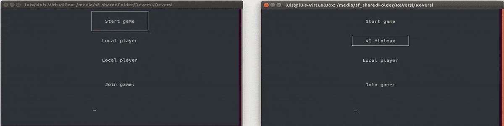

# Reversi
Reversi board game running in terminal using ncurses.

Game info: https://en.wikipedia.org/wiki/Reversi

## Features
- Local play
- Play vs AI (Using Simple AI, or minimax algorithm)
- Play over network (TCP connection)

Menu:

Ingame:

AI vs AI over network connection:

## Build
### Requirements:
C++ 14 compatible compiler, unix system with ncurses

~~~~
make build
./Reversi

~~~~
